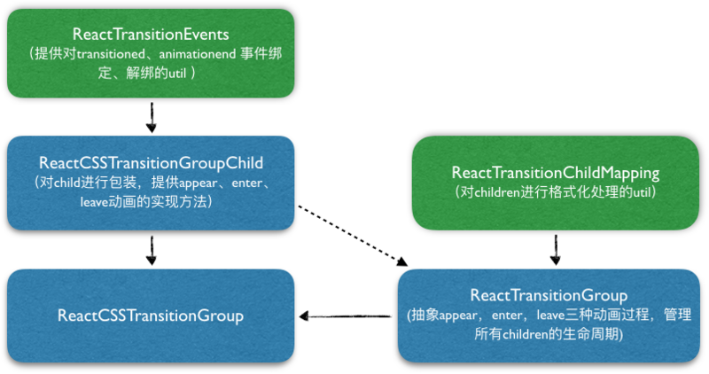
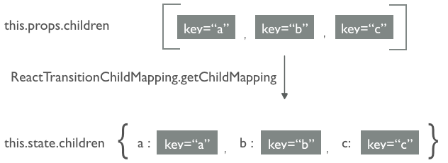
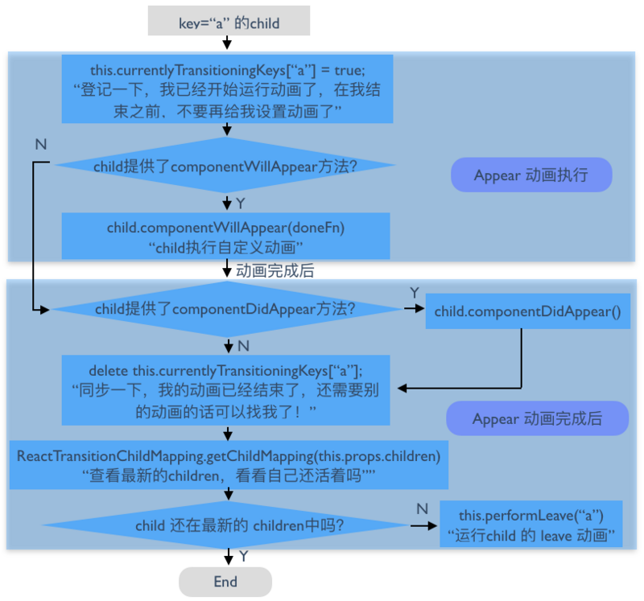
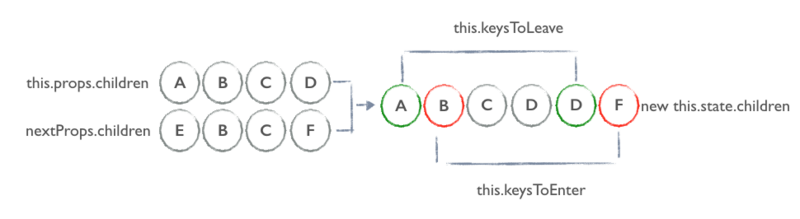
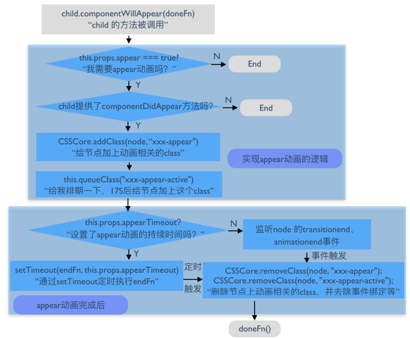

# React源码剖析系列 － 玩转 React Transition


过去一年，React 给整个前端界带来了一种新的开发方式，我们抛弃了无所不能的 DOM 操作。对于 React 实现动画这个命题，DOM 操作已经是一条死路，而 CSS3 动画又只能实现一些最简单的功能。这时候 ReactCSSTransitionGroup Addon，无疑是一枚强心剂，能够帮助我们以最低的成本实现例如节点初次渲染、节点被删除时添加动效的需求。本文将会深入实现原理来玩转 ReactCSSTransitionGroup。

### 初窥 ReactCSSTransitionGroup

在介绍 ReactCSSTransitionGroup 的用法前，先来实现一个常规 transition 动画，要实现的是删除某个节点的时候，让该节点的透明度不断的变大。

````js
handleRemove(item) {
  const { items } = this.state;
  const len = items.length;

  this.setState({
    items: items.reduce((result, entry) => {
      return entry.id === item.id ? [...result, { ...item, isRemoving: true }] : [...result, item];
    }, [])
  }, () => {
    setTimeout(() => {
      this.setState({
        items: items.reduce((result, entry) => {
          return entry.id === item.id ? result : [...result, item];
        }, [])
      });
    }, 500);
  });
},

render() {
  const items = this.state.items.map((item, i) => {
    return (
      <div
        key={item.id} onClick={this.handleRemove.bind(this, item)}
        className={item.isRemoving ? 'removing-item' : ''}>
        {item.name}
      </div>
    );
  });

  return (
    <div>
      <button onClick={this.handleAdd}>Add Item</button>
      <div>
        {items}
      </div>
    </div>
  );
}

````

同时我们在 CSS 中需要提供如下的样式

````js
.removing-item {
  opacity: 0.01;
  transition: opacity .5s ease-in;
}
````


相同的需求，使用 ReactCSSTransitionGroup 创建动画会是怎么的呢？

````js
handleRemove(i) {
  const { items } = this.state;
  const len = items.length;

  this.setState({
    items: [...items.slice(0, i),  ...item.slice(i + 1, len - 1)]
  });
},

render() {
  const items = this.state.items.map((item, i) => {
    return (
      <div key={item} onClick={this.handleRemove.bind(this, i)}>
        {item}
      </div>
    );
  });

  return (
    <div>
      <button onClick={this.handleAdd}>Add Item</button>
      <ReactCSSTransitionGroup transitionName="example">
        {items}
      </ReactCSSTransitionGroup>
    </div>
  );
}

````

在这个例子中，当新的节点从 ReactCSSTransitionGroup 中删除时，这个节点会被加上 example-leave 的 class，在下一帧中这个节点还会被加上 example-leave-active 的 class，通过添加以下 CSS 代码，被删除的节点就会有动画的效果。

````js
.example-leave {
  opacity: 1;
  transition: opacity .5s ease-in;
}

.example-leave.example-leave-active {
  opacity: 0.01;
}
````

从这个例子，我们可以看到 ReactCSSTransition 可以把开发者从一大堆动画相关的 state 中解放出来，只需要关心数据的变化，以及 CSS 的 transition 动画逻辑。

后面将会仔细分析 ReactCSSTransitionGroup 的源码实现。在看代码之前，大家可以先看 官网的文档，对 ReactCSSTransitionGroup 的用法进一步了解。看完之中，可以想想两个问题：


- appear 动画和 enter 动画有什么区别？
- ReactCSSTransitionGroup 子元素的生命周期是怎样的？

## ReactCSSTransitionGroup 模块关系

ReactCSSTransitionGroup 的源码分为5个模块，我们先看看这5个模块之间的关系：



我们来整理一下这几个模块的分工与职责：

- ReactTransitionEvents 提供了对各种前缀的 transitionend、animationend 事件的绑定和解绑工具
- ReactTransitionChildMapping 提供了对 ReactTransitionGroup 这个 component 的 children 进行格式化的工具
- ReactCSSTransitionGroup 会调用 ReactCSSTransitionGroupChild 对 children 中的每个元素进行包装，然后将包装后的 children 作为 ReactTransitionGroup 的 children 。


从这个关系图里面可以看到，ReactTransitionGroup 和 ReactCSSTransitionGroupChild 才是实现动画的关键部分，因此，本文会从 ReactTransitionGroup 开始解读，然后从 ReactCSSTransitionGroupChild 中解读怎么实现具体的动画逻辑。

## ReactTransitionGroup 源码解读


下面我们按照 React 生命周期来解读 ReactTransitionGroup。


### 初次 Mount

- 在初始化 state 的时候，将 this.props.children 转化为对象，其中对象的 key 就是 component key，这个 key 与 children 中的元素一一对应，然后将该对象设置为 this.state.children；



- 在初次 render 的时候，将 this.state.children 中每一个普通的 child component 通过指定的 childFactory 包裹成一个新的 component，并渲染成指定类型的 component 的子元素。在下面的源码中也可以看到，我们在创建过程中给每个 child 设置的 key 也会作为 ref，方便后续索引。

````js
render: function() {
  var childrenToRender = [];
  for (var key in this.state.children) {
    var child = this.state.children[key];

    if (child) {
      childrenToRender.push(React.cloneElement(
        this.props.childFactory(child),
        {ref: key, key: key}
      ));
    }
  }
  return React.createElement(
    this.props.component,
    this.props,
    childrenToRender
  );
}
````
- 初次 mount 后，遍历 this.state.children 中的每个元素，依次执行 appear 动画的逻辑。




### 更新 component


当接收到新的 props 后，先将 nextProps.children 和 this.props.children 合并，然后转化为对象，并更新到 this.state.children。计算在 nextProps 中即将 leave 的 child，如果该元素当前没有正在运行的动画，将该元素的 key 保存在 keysToLeave。

对于 nextProps 中新的 child，如果该元素没有正在运行的动画的话（也许会疑惑，一个刚进入的元素怎么会有动画正在运行呢？下文将会解释），将该元素的 key 保存在 keysToEnter。从这里也能看出来，本来在 nextProps 中即将 leave 的 child 会被保留下来以达到动画效果，等动画效果结束后才会被 remove。



component 更新完成后，对 keysToEnter 中的每个元素执行 enter 动画的逻辑，对 keysToLeave 中的每个元素执行 leave 动画的逻辑。由于 enter 动画的逻辑和 appear 动画的逻辑几乎一模一样，无非是变成执行 child 的componentWillEnter 和 componentDidEnter 方法。

leave 动画稍有不同，看下面源码可以看到，在 leave 动画结束后，如果发现该元素重新 enter，这里会再次执行 enter 动画，否则的话通过更新 state 中的 children 来删除相应的节点。这里也可以回答，为什么对刚 enter 的元素，也要判断该元素是否正在进行动画，因为如果该元素上一次 leave 的动画还没有结束，那么这个节点还一直保留在页面中运行动画。

另外，大家有没有注意到一个问题，如果 leave 动画的回调函数没有被调用，那么这个节点将永远不会被移除。

````js
if (currentChildMapping && currentChildMapping.hasOwnProperty(key)) {
  // This entered again before it fully left. Add it again.
  this.performEnter(key);
} else {
  this.setState(function(state) {
    var newChildren = assign({}, state.children);
    delete newChildren[key];
    return {children: newChildren};
  });
}
````


至此，我们看到 ReactTransitionGroup 没有实现任何具体的动画逻辑。

## ReactCSSTransitionGroup

搞清楚 ReactTransitionGroup 的原理以后，ReactCSSTransitionGroup 做的事情就很简单了。简单地说， ReactCSSTransitionGroup 调用了 ReactTransitionGroup ，提供了自己的 childFactory 方法，而这个 childFactory 则是调用了 ReactCSSTRansitionGroupChild 。

````js
_wrapChild: function(child) {
  // We need to provide this childFactory so that
  // ReactCSSTransitionGroupChild can receive updates to name, enter, and
  // leave while it is leaving.
  return React.createElement(
    ReactCSSTransitionGroupChild,
    {
      name: this.props.transitionName,
      appear: this.props.transitionAppear,
      enter: this.props.transitionEnter,
      leave: this.props.transitionLeave,
      appearTimeout: this.props.transitionAppearTimeout,
      enterTimeout: this.props.transitionEnterTimeout,
      leaveTimeout: this.props.transitionLeaveTimeout,
    },
    child
  );
}
````


下面来看 ReactCSSTransitionGroupChild 是怎么实现节点的动画的。以 appear 动画为例，在 child.componentWillAppear 被调用的时候，给该节点加上 xxx-appear 的 className ，并且在一帧（React 里是写死的17ms）后，给该节点加上 xxx-appear-active 的 className ，最后在动画结束后删除 xxx-appear 以及 xxx-appear-active 的 className。



enter、leave 动画的实现类似。到这里源码就解读完了，其中，还有一些细节要去注意的。


## 隐藏在 key 里的秘密
在源码解读的过程中，我们发现 ReactTransitionGroup 会将 children 转化为对象，然后通过 for...in... 遍历。对于这一过程，会不会感到有所疑虑，ReactTransitionGroup 怎么保证子节点渲染的顺序。

对于这个问题，React 的处理过程可以简化为下面的代码，测试结果显示，当 key 为字符串类型时，for...in... 遍历的顺序和 children 的顺序能够保持一致；但是当 key 为数值类型时，for...in... 遍历的顺序和 children 的顺序就不一定能够保持一致，大家可以用下面这段简单的代码测试一下。

````js
function test (o) {
  var result = {};
  for (var i = 0, len = o.length; i < len; i++) {
    result[o[i].key] = o[i];
  }
  for (var key in result) {
    if (result[key]) {
      console.log(key, result[key]);
    }
  }
}
````

因此，我们知道 ReactCSSTransitionGroup 所有子 component 的 key 千万不要设置成纯数字，一定要是字符串类型的。

## transitionend 之殇

在 React 0.14 版本中，React 已经表示将在未来的版本中废弃监听 transitionend、 animationend 事件，而是通过设置动画的 timeout 来达到结束动画的目的，有没有想过 React 为什么要放弃原生事件，而改用 setTimeout。

事实上，原因很简单，transitontend 事件在某些情况是不会被触发。在 transitionend 的 MDN文档 中有这么几行文字：

> In the case where a transition is removed before completion, such as if the transition-property is removed, then the event will not fire. The event will also not fire if the animated element becomes display: none before the transition fully completes.


- 当动画元素的 transition 属性在动画完成前被移除了，transitionend 事件不会被触发
- 当动画元素在动画完成前，display 样式被设置成 "none"，这种情况 transitionend 事件不会被触发
- 当动画还没完成，当前浏览器标签页失焦很长的时间（大于动画时间），transitionend 事件不会被触发，直到该标签页重新聚焦后 transitionend 事件才会触发


正是由于 transitionend 不会触发，会导致隐形 bug，可以看其中一个 [bug](https://github.com/xile611/test-transition)。

## 总结


- appear 动画是 ReactCSSTransitionGroup 组件初次 mount 后，才会被添加到 ReactCSSTransitionGroup 的所有子元素上。
- enter 动画是 ReactCSSTransitionGroup 组件更新后，被添加到新增的子元素上。
- ReactCSSTransitionGroup 提供创建 CSS 动画最简单的方法，对于更加个性化的动画，大家可以通过调用 ReactTransitionGroup 自定义动画。

## 参考资料

- [React 官方文档](https://facebook.github.io/react/docs/animation.html)
- [transitionend 事件](https://developer.mozilla.org/en-US/docs/Web/Events/transitionend)

